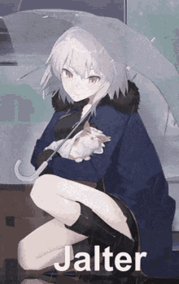

<h1 align="center">╰☆☆ Hi 👋, I'm 𝓩𝓪𝓭𝓮𝓝𝓸𝓿𝓪 ☆☆╮</h1>

<h3 align="center">★ A novice programmer ★</h3>

 
<h4 align="center">🚀彡 𝓐𝓫𝓸𝓾𝓽 𝓜𝓮 彡🚀</h4>

  
- 👀 I’m interested in lots of things but sadly i am too lazy to do anything :/
- 🌱 I’m currently taking my diploma in Infocomm and security from college. 
- 💞️ I’m looking to collaborate on making a project that interests me.(AI,blockchain,Datascience,Virtual/Augmented reality).
- 🚀 Weird side projects :)
- ⚡ Nerd

 
 
 

<h3 align="left">⚒️𝚃𝚘𝚘𝚕𝚜/𝚂𝚔𝚒𝚕𝚕𝚜</h3>
<h4 align="left">𝙻𝚊𝚗𝚐𝚞𝚊𝚐𝚎𝚜</h4>

 
 
 
 
 

 

 
<h4 align="left">𝙵𝚛𝚊𝚖𝚎𝚠𝚘𝚛𝚔𝚜</h4>

  
  

 
<h4 align="left">𝚃𝚘𝚘𝚕𝚜</h4>

 
 
 

 

<h3 align="left">Contact me</h3>

 𝙈𝙖𝙡𝙚𝙫𝙤𝙡𝙚𝙣𝙘𝙚#8272

<h3 align="left">Miscellaneous</h3>

Also GME to the moon!
Hopefully i find the strength to do some projects lmao

https://www.hackerrank.com/ZadeNova?hr_r=1

