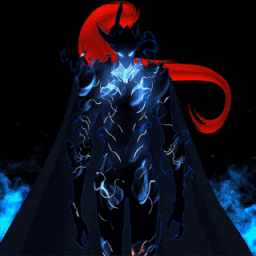

<h1 align="center">╰☆☆ Hi 👋, I'm 𝓩𝓪𝓭𝓮𝓝𝓸𝓿𝓪 ☆☆╮</h1>

<h3 align="center">★ A novice programmer ★</h3>

<h4 align="center">🚀彡 𝙰𝚋𝚘𝚞𝚝 𝙼𝚎 彡🚀</h4>

 

- 👀 I’m interested in lots of things but sadly i am too lazy to do anything :/
- 🌱 I’m currently taking my diploma in Infocomm and security from college. 
- 💞️ I’m looking to collaborate on making a project that interests me.(AI,blockchain,Datascience,Virtual/Augmented reality).
- 🚀 Weird side projects :)
- ⚡ Nerd

  
Still attending college year 3 semester 1. 1 more year to go before graduation.

 
 
 
 

<h3 align="left">⚒️𝚃𝚘𝚘𝚕𝚜/𝚂𝚔𝚒𝚕𝚕𝚜</h3>
  
<h4 align="left">𝙻𝚊𝚗𝚐𝚞𝚊𝚐𝚎𝚜</h4>

 
 
 
 
 

 

<h4 align="left">𝙵𝚛𝚊𝚖𝚎𝚠𝚘𝚛𝚔𝚜</h4>

  
  

<h4 align="left">𝚃𝚘𝚘𝚕𝚜</h4>

 
 
 

 
<h3 align="left">𝙷𝚘𝚠 𝚝𝚘 𝚌𝚘𝚗𝚝𝚊𝚌𝚝 𝚖𝚎</h3>

  
  
 

<h3 align="left">𝙼𝚒𝚜𝚌𝚎𝚕𝚕𝚊𝚗𝚎𝚘𝚞𝚜</h3>

 

 
 
 
 
<h2 align="Center">◦•●◉ 𝚃𝚑𝚊𝚗𝚔𝚜 𝚏𝚘𝚛 𝚛𝚎𝚊𝚍𝚒𝚗𝚐! ◉●•◦</h2>

